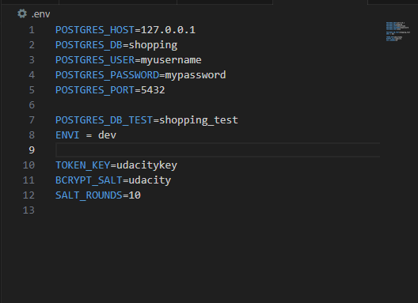
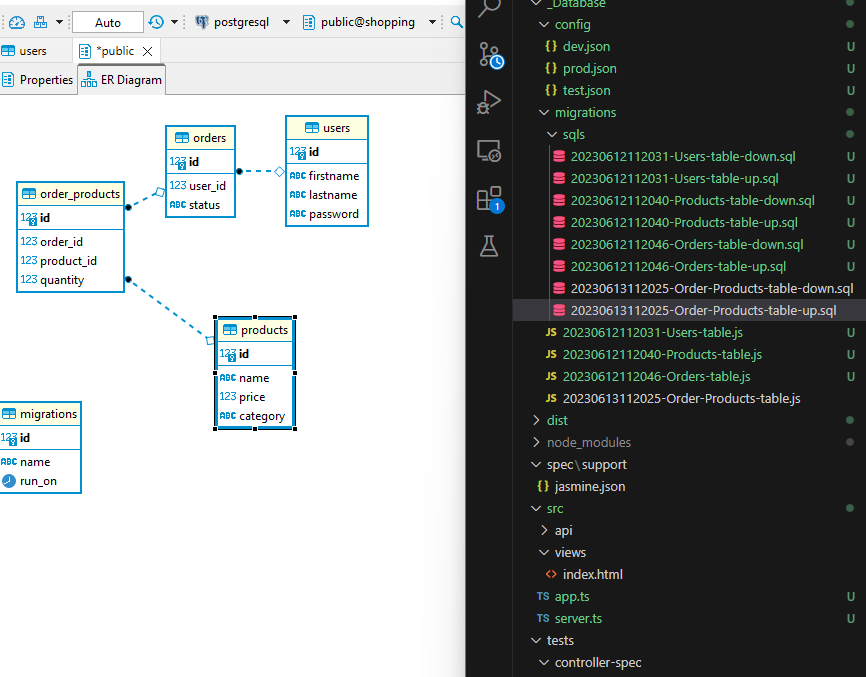

# Storefront Backend Project

## Enviromental Variables Set up
Bellow are the environmental variables that needs to be set in a `.env` file. This is the default setting that I used for development, but you can change it to what works for you. 


## Getting Started
Start app with `npm run start`,
After start up, the server will start on port `8080` and the database on port `5432`

Access http://localhost:8080 to has instruction


(token can to use: eyJhbGciOiJIUzI1NiJ9.Mg.s0bq9zBGOBHjWqrcTnVjCxh_2K8q0bJI9jrQDa-Itks)
## Dependencies


## Steps to Completion
### Create database


### Migrate Database


Relationship between orders and products


### Models


### Express Handlers


## Token and Authentication
Tokens are passed along with the http header as 
```
Authorization   Bearer <token>
```
or as paramater ok too.


## Testing
Run test with `npm run test`
Result test


result register


