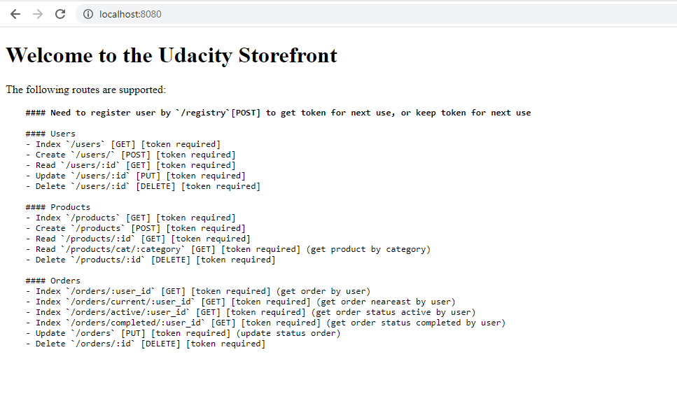

# Storefront Backend Project

## Getting Started

Access http://localhost:8080 to has instruction



## Dependencies


## Steps to Completion
### Create database


### Migrate Database


### Models


### Express Handlers


## Token and Authentication
Tokens are passed along with the http header as 
```
Authorization   Bearer <token>
```
or as paramater ok too.


## Testing
Result test


result register


